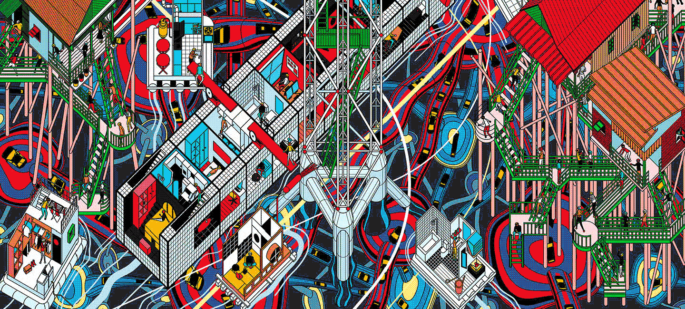

## This course introduces the student to a wide range of artists, thinkers and concepts associated with art/techno/science collaboration. 
---
As per the Brock University glossary, unless otherwise noted, this course does not require that you attend at a specific time, but will still have deadlines that you will need to adhere to. Make sure you set reminders for yourself to complete all course work on time! When looking at an asynchronous course, you may be wondering why it still has a specified time. This is to allow the instructor the option of using the time as office hours or a meet-time if needed. Instructors may or may not choose to use the time set. There may be some occasions where we may all need to meet through video conferencing or one-on-one at a designated time – this will be announced on the Sakai website and/or communicated through email.
[sample link](https://www.youtube.com/watch?v=v3HPCarhOyg&ab_channel=Dezeen)
